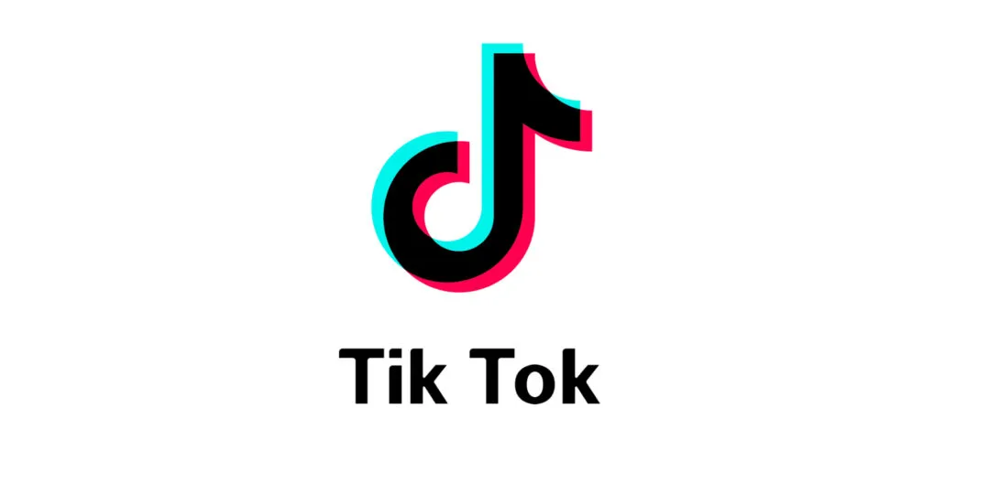

# 🎵 TikTok Video Downloader Pro


A powerful and efficient Python tool for downloading TikTok videos with advanced features and error handling.

[](https://www.python.org/)
[](https://www.jetbrains.com/pycharm/)
[](https://git-scm.com/)
[](https://telegram.org/)
[](https://github.com/yt-dlp/yt-dlp)
[](https://opensource.org/licenses/MIT)

## ✨ Features

- 📥 Download TikTok videos in highest quality available
- 🎯 Custom filename support with timestamps
- 🗂️ Automatic directory management
- 🔄 Progress tracking with real-time updates
- 🛡️ Robust error handling and validation
- 🌐 Browser cookie integration for better compatibility
- 📝 Detailed logging and status reporting

## 🚀 Prerequisites

- Python 3.7 or higher
- Required packages:
  ```
  yt-dlp>=2023.3.4
  typing>=3.7.4
  ```

## 📦 Installation

1. Clone the repository:
```bash
git clone https://github.com/vgvr0/TikTok-Video-Downloader-using-Python-and-yt-dlp
cd tiktok-downloader-pro
```

2. Create a virtual environment (optional but recommended):
```bash
python -m venv venv
source venv/bin/activate  # On Windows: venv\Scripts\activate
```

3. Install dependencies:
```bash
pip install -r requirements.txt
```

## 💻 Usage

### Basic Usage

```python
from tiktok_downloader import TikTokDownloader

# Initialize downloader
downloader = TikTokDownloader()

# Download single video
video_url = "https://www.tiktok.com/@username/video/1234567890"
downloader.download_video(video_url)
```

### Advanced Usage

```python
# Custom save location and filename
downloader = TikTokDownloader(save_path='my_tiktoks')
downloader.download_video(video_url, custom_name="dance_video")

# Download multiple videos
urls = [
    "https://www.tiktok.com/@user1/video/1234567890",
    "https://www.tiktok.com/@user2/video/0987654321"
]
for url in urls:
    downloader.download_video(url)
```

## 🛠️ Configuration Options

| Parameter | Description | Default |
|-----------|-------------|---------|
| save_path | Directory to save videos | 'tiktok_videos' |
| custom_name | Custom name for the video | None |
| use_cookies | Use browser cookies | True |
| quiet_mode | Suppress progress output | False |

## 📋 Example Output

```
Downloading: 45.2% at 1.2 MB/s ETA: 00:15
Download completed, finalizing...
Video successfully downloaded: my_tiktoks/dance_video_20240106_123045.mp4
```

## 🤝 Contributing

1. Fork the repository
2. Create your feature branch (`git checkout -b feature/AmazingFeature`)
3. Commit your changes (`git commit -m 'Add some AmazingFeature'`)
4. Push to the branch (`git push origin feature/AmazingFeature`)
5. Open a Pull Request

## 📝 License

This project is licensed under the MIT License - see the [LICENSE](LICENSE) file for details.

## 🙏 Acknowledgments

- [yt-dlp](https://github.com/yt-dlp/yt-dlp) for the amazing download capabilities
- TikTok for providing the content platform
- All contributors and users of this project

## ⚠️ Disclaimer

This tool is for educational purposes only. Make sure to comply with TikTok's terms of service and respect content creators' rights when using this tool.

